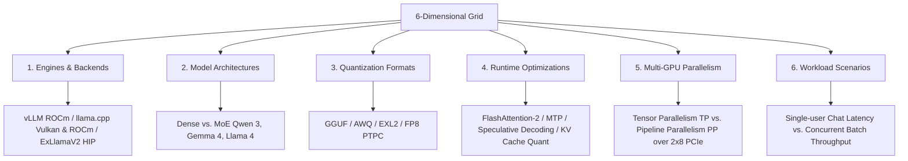

# Bleeding-Edge Multi-GPU Performance Testing Matrix for AMD Local Inference

This document establishes the architecture and specific benchmark test cases for evaluating local Large Language Model (LLM) performance on a split **2 x 16GB AMD GPU configuration** connected via **2 x 8 PCIe channels**. Designed for longitudinal tracking, this testing matrix balances a static control baseline with experimental, high-velocity open-source inference developments to measure performance gains over time.

---

## 1. The 6-Dimensional Testing Grid

To evaluate the absolute maximum speed (State of the Art throughput and low latency), the testing framework maps across six core axes. Each dimension is chosen to address the specific performance trade-offs of consumer-grade or split-GPU AMD hardware with constrained inter-GPU bandwidth.

### I. Engines & Backends
*   **vLLM (ROCm)**: The industry standard for high-throughput serving. On AMD, vLLM compiles with native ROCm/HIP, leveraging optimized kernels like `AITER` (AI Tensor Engine for ROCm) for fused operations.
*   **llama.cpp (ROCm / Vulkan)**: The leading framework for GGUF execution. It supports both Vulkan and ROCm backends. The Vulkan backend offers high portability, while the ROCm backend provides direct HIP-compiler optimizations.
*   **ExLlamaV2 (ROCm/HIP)**: A highly optimized CUDA engine adapted for AMD on Linux. Known for yielding the highest single-user token-generation speeds (TPOT) for quantized formats (EXL2/GPTQ).
*   **MLC LLM (Vulkan / ROCm)**: A compilation-based engine that uses TVM to build AMD-native binaries. Highly efficient for squeezing raw performance out of specific model architectures.
*   **Note on Out-of-Scope Engines**: Nvidia-proprietary engines like **TensorRT-LLM** are omitted due to lack of AMD hardware compatibility.

### II. Model Architectures
*   **Dense Models**: Models like **Gemma 4 (E4B-8B)** and **Qwen3-14B-Instruct** require processing every parameter for every token. They test raw memory bandwidth and compute efficiency.
*   **Mixture of Experts (MoE)**: Models like **Gemma-4-26B-A4B-MoE** (25.2B total, 3.8B active) and **Qwen3-30B-A3B-MoE** (30B total, ~3B active) are highly attractive for split-GPU setups. They pack large capacity (30B parameters) into VRAM but only activate a fraction of parameters per token (~3B), keeping compute requirements low and inference speed high, provided the router and routing communication are fast.

### III. Quantization Formats
*   **GGUF (llama.cpp)**: Excellent for mixed CPU-GPU offloading and highly granular integer quantizations (e.g., Q4_K_M, IQ4_XS).
*   **AWQ / GPTQ**: Actively used by vLLM for high-throughput batching, utilizing activation-aware scaling to retain accuracy.
*   **EXL2 (ExLlamaV2)**: Custom format utilizing variable bitrate quantization per layer. Crucial for maximizing throughput on consumer GPUs.
*   **FP8 (PTPC/Quark)**: Pushes the limits of hardware matrix engines. The **PTPC-FP8** (Per-Token Per-Channel FP8) format on vLLM and **AMD Quark** pre-quantized models offer near-BF16 quality at double the throughput.

### IV. Runtime Optimizations
*   **FlashAttention-2**: ROCm-optimized Composable Kernel (CK) or Triton-based FlashAttention. Reduces memory traffic in attention layers.
*   **KV Cache Quantization**: Reducing the KV Cache to 8-bit (FP8/INT8) or 4-bit (INT4). Crucial on 16GB GPUs to prevent Out-Of-Memory (OOM) errors during long-context generation.
*   **Speculative Decoding**: Using a small draft model (e.g., Qwen3-0.6B) to predict tokens, which a larger target model (Qwen3-30B) validates in parallel. This shifts the bottleneck from memory bandwidth to compute.
*   **Multi-Token Prediction (MTP)**: Utilizing auxiliary prediction heads to output multiple tokens per step, dramatically boosting generation speed.

### V. Multi-GPU Sharding Strategies
*   **Tensor Parallelism (TP=2)**: Splitting layers horizontally across both GPUs. This requires heavy inter-GPU communication (All-Reduce operations via ROCm RCCL) at the end of every attention and MLP layer. On standard consumer Motherboards, this traffic is forced over the **2 x 8 PCIe slots**, which lack a high-speed bridge (Infinity Fabric/xGMI). This creates a critical transfer bottleneck.
*   **Pipeline Parallelism (PP=2) / Layer-Splitting**: Loading the first half of the layers on GPU 0 and the second half on GPU 1. Communication is reduced to a single activation transfer per token. This matches the slow 2x8 PCIe lanes perfectly, although it introduces idle GPU time (pipeline bubble) unless batched.

### VI. Workload Scenarios
*   **Single-User Chat / Agentic Reasoning**: Low batch size (BS=1), high sequence length. The performance metric is **Time to First Token (TTFT)** for prompt processing and **Time Per Output Token (TPOT)** for generation.
*   **High-Throughput Serving**: Large batch sizes (BS=16-64), concurrency test. The objective is to maximize **Tokens/Second (Throughput)** at the cost of individual token latency.

---

## 2. The Crucible Matrix (Longitudinal Tracking Grid)

The following table defines the 7 representative configurations designed to evaluate and track inference improvements. It includes **Static Controls** (for engine engine/ROCm optimization tracking) and **Bleeding-Edge Configurations** pushing the limit of the 2x16GB VRAM ceiling.

| Test ID | Model | Architecture | Engine (Nightly/Source) | Backend | Quantization | Parallelism | Optimizations | Target Workload | Rationale |
| :--- | :--- | :--- | :--- | :--- | :--- | :--- | :--- | :--- | :--- |
| **CTRL-01-LLAMA3-VLLM** | Llama-3-8B-Instruct | Dense | vLLM (Nightly) | ROCm | FP8 (Quark) | TP = 2 | PagedAttention, FlashAttention-2 | Batching Concurrency (BS=32) | **Control Baseline**: Tracks RCCL interconnect efficiency and FP8 GEMM speed over updates. |
| **CTRL-02-LLAMA3-CPP** | Llama-3-8B-Instruct | Dense | llama.cpp (Master) | ROCm | Q4_K_M (GGUF) | PP = 2 (Layer split) | FlashAttention, KV Cache FP16 | Single-User Chat (BS=1) | **Control Baseline**: Tracks pure single-thread/CPU-GPU driver efficiency improvements. |
| **EDGE-01-GEMMA4-EXL2** | Gemma-4-26B-A4B-MoE | MoE | ExLlamaV2 (Source) | ROCm (HIP) | EXL2 (4.0 bpw) | PP = 2 (Layer split) | FlashAttention-2, 4-bit KV Cache | Low-latency Chat / Agents | Pushes 3.8B active parameter speed with layer splitting over slow PCIe lanes. |
| **EDGE-02-GEMMA4-VLLM** | Gemma-4-26B-A4B-MoE | MoE | vLLM (Nightly) | ROCm | FP8 (PTPC-FP8) | TP = 2 | PagedAttention, Triton FlashAttention | High-Throughput Batching | Measures MoE kernel merging performance when forced to use TP=2 over PCIe 2x8. |
| **EDGE-03-QWEN3-CPP** | Qwen3-30B-A3B-MoE | MoE | llama.cpp (Master) | Vulkan | Q4_K_M (GGUF) | PP = 2 (Layer split) | Speculative Decoding (Draft: Qwen3-0.6B), FlashAttn | High-Speed Reasoning | Tests Vulkan backend capability with advanced speculative decoding on hybrid MoE. |
| **EDGE-04-QWEN3-VLLM** | Qwen3-14B-Instruct | Dense | vLLM (Nightly) | ROCm | FP8 (Quark) | TP = 2 | Multi-Token Prediction (MTP), PagedAttention | Agent Workflows / Long Context | Pushing dense model throughput via multi-token prediction kernels. |
| **EDGE-05-GEMMA4-SINGLE**| Gemma-4-E4B-8B | Dense | ExLlamaV2 (Source) | ROCm (HIP) | FP16 (Unquantized) | None (Single GPU) | FlashAttention-2 | Raw Generation Speed | **PCIe Baseline**: Runs on a single GPU0 to quantify the exact speed penalty of multi-GPU configurations. |

---

## 3. Quantitative & Qualitative Metrics (The Knowns)

To guarantee scientific accuracy and reproducibility across longitudinal runs, benchmarks must capture detailed hardware, software, and performance metrics.

### I. Performance Metrics
1.  **Time to First Token (TTFT) (ms)**: Measures prompt processing throughput. Critical for agentic tool-use loops.
2.  **Time Per Output Token (TPOT) (ms/token)**: Generation speed per token. Directly relates to human reading speed.
3.  **Throughput (Tokens/Second)**: Total tokens generated per second across all active streams under concurrent batch loads.
4.  **Context Window Efficiency**: Latency scaling curve at $1k, 4k, 8k, 16k,$ and $32k$ context sizes.
5.  **VRAM Allocation**: Active VRAM usage on GPU 0 and GPU 1 (weights vs. KV Cache reservation).

### II. Metadata Logging
Each run must output a JSON log containing:
*   **Hardware Metadata**:
    *   *GPU Chipsets*: Exact models (e.g., `2 x Navi 32 [Radeon RX 7800 XT]`).
    *   *PCIe Layout*: Interface speed and width per GPU slot (e.g., `PCIe Gen 4.0 x8 / PCIe Gen 4.0 x8`). Checked via `lspci -vvv` for link speed verification.
    *   *VRAM Pool*: Memory capacity and bus width (e.g., `16384 MB GDDR6 / 256-bit`).
    *   *Host CPU & System RAM*: CPU model and RAM speed (impacts offloading/speculative performance).
*   **Software Metadata**:
    *   *ROCm Version*: Exact ROCm runtime and HIP compiler version (e.g., `ROCm 6.4.1`).
    *   *Engine Commit*: Full 40-character Git commit hash for the build (e.g., `vllm @ e2f8c5b6...`).
    *   *Model Checkpoint Hash*: SHA-256 hash or Hugging Face revision tag (e.g., `main @ 1a2b3c4d...`).
    *   *Kernel Backend*: Active Triton or Composable Kernel driver version.

---

## 4. Performance Blind Spots (The Unknowns)

Performance matrices capture structured throughput, but they fail to account for real-world execution issues that occur during continuous operation:

*   **PCIe Interconnect Latency Masking**:
    During low-batch generation (BS=1), the GPU spends a significant portion of time waiting for data transfers. The benchmark reports low TPOT, but it masks the fact that the GPU cores are idling. This means the system is consuming full power while operating far below its peak FLOPS potential.
*   **Nightly Build Instability**:
    Compiling engines from source/nightlies introduces regression risks. An update that improves speed by 15% might also introduce memory leaks that cause crashes after 15 minutes of continuous execution, or cause silent token degradation (NaN outputs) that benchmarking scripts do not flag.
*   **Dynamic VRAM Fragmentation**:
    PagedAttention minimizes fragmentation, but under massive context sequences or high-concurrency requests, the driver can still experience memory fragmentation. This causes sudden Out-of-Memory (OOM) crashes midway through a request, which are not predicted by start-of-run allocation metrics.
*   **Driver Crash Recovery Latency**:
    ROCm is notorious for failing to recover gracefully from VRAM OOMs on consumer hardware. A crash often puts the system into a hung state (requiring a full system reboot), making automated remote testing pipelines highly brittle.
*   **Thermal/Power Throttling**:
    In a standard desktop tower housing two 16GB cards, the top card often runs significantly hotter due to restricted airflow. Over long testing loops, the top GPU will thermal throttle, dropping clocks and skewing throughput results. This physical constraint is completely hidden by software performance counters.
