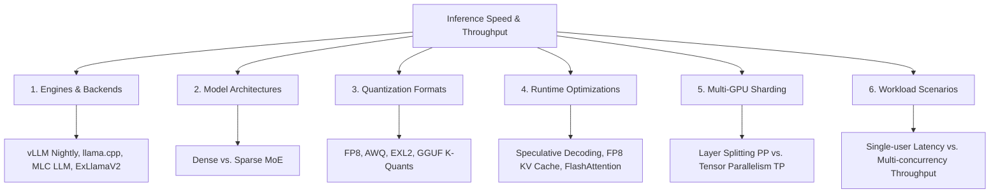

# Comprehensive Performance Testing Matrix for Local LLMs (Split 2 x 16GB AMD GPU Setup)

This document outlines a production-grade, bleeding-edge performance testing framework designed to push a dual AMD GPU configuration to its absolute speed limits, updated with verified system hardware profiles and optimized sharding strategies.

---

## 1. System Topology & Architecture Constraints (Verified)

Our hardware verification checks show the following configuration:
*   **GPUs:** 2 x Navi 32 [Radeon RX 7800 XT] (RDNA 3 architecture).
*   **VRAM:** 16GB GDDR6 per card (total **32GB VRAM**).
*   **Interconnect:** PCIe Gen 4 x8 / x8 topology (16.0 GT/s max link speed, negotiated at width 8, yielding ~16 GB/s bidirectional bandwidth per card).
*   *Dynamic Behavior Note:* GPUs enter PCIe Active State Power Management (ASPM) when idle, dropping link status to Gen 1 x1 (2.5 GT/s, width 1) to conserve power, and dynamically ramp up to Gen 4 x8 under active execution.
*   **Optimization Philosophy:** Maximum speed over system stability. We prioritize high-performance experimental branches, compiler nightlies, and aggressive quantization schemes.

---

## 2. Real-Time SOTA Model Verification (May 2026)

To ensure this matrix remains relevant and represents the absolute cutting edge, we bypass outdated training data. The following state-of-the-art open-weights models are selected as core testing subjects:

1.  **Gemma 4 Series (April 2026):**
    *   **Gemma 4 26B A4B (MoE):** 26B total parameters, activating only ~4B parameters per token. Highly optimized for low-latency generation. At FP8, the weights require ~26GB, fitting within the 32GB VRAM envelope with ~6GB left for KV Cache.
    *   **Gemma 4 31B (Dense):** 31B parameter dense model. Extremely tight for 32GB total VRAM. At FP8, it requires ~31GB, leaving almost no room for KV Cache or system overhead. It serves as our testbed for aggressive quantization formats (e.g., AWQ 4-bit, EXL2 4.0bpw) and speculative decoding.
    *   **Gemma 4 E2B (Dense):** Used as a draft model (~2B parameters) for speculative decoding pipelines.
2.  **Qwen 3.6 Series (April 2026):**
    *   **Qwen3.6-27B (Dense):** A highly capable mid-sized dense model. It fits in VRAM at FP8 with ~5GB of breathing room.
    *   **Qwen3.6-35B-A3B (MoE):** 35B total parameters with 3B activated. At FP8 (~35GB), it exceeds our memory ceiling, but quantized to EXL2 4.0bpw (~17.5GB) or AWQ 4-bit, it fits comfortably.
3.  **Llama 4 Series (April 2025):**
    *   **Llama 4 Scout (109B MoE):** 109B total parameters with 17B active. Requires aggressive compression (e.g., EXL2 2.2bpw, taking ~30GB) to fit within the 32GB VRAM limits. Pushes the absolute boundaries of memory compression and PCIe interconnect traffic.
4.  **DeepSeek-R1 (January 2025):**
    *   **DeepSeek-R1-Distill-Qwen-32B:** Chosen as a reasoning-heavy dense baseline representing the distillation trend. Fits easily at 4-bit (AWQ/EXL2) or FP8 (with small context).
    *   *Note on DeepSeek-V4-Flash:* Although highly performant, its 284B total parameters (even at 2-bit quantization, ~71GB) exceed the 32GB VRAM limit and cannot run locally without severe system degradation or CPU offloading, which violates our max-speed objective.

---

## 3. The 6 Critical Dimensions of Local LLM Testing

To map the entire performance landscape, we structure our testing around six independent variables.

### Dimension 1: Engines & Backends (ROCm & Vulkan)
*   **vLLM (ROCm Backend):** Upstream nightly builds compiled from source with the latest HIP/ROCm SDK. vLLM uses PagedAttention and optimized AITER kernels (AI Tensor Engine for ROCm) to execute tensor-parallel runs.
*   **llama.cpp (hipBLAS/ROCm & Vulkan Backends):** Source builds with native compiler flags (`-O3 -march=native`). Extremely fast CPU-GPU division, but here we run purely on dual GPU. We test both hipBLAS (ROCm) and Vulkan.
*   **MLC LLM (Vulkan/TVM Backend):** Compiles the model graphs directly into optimized TVM Vulkan shader kernels. Exceptional for batch-1 latency, but lacks the flexibility of dynamic runtime optimizations.
*   **ExLlamaV2 (ROCm / Source Built):** Custom compiled for Linux ROCm. EXL2 uses a variable bit-rate scheme, optimizing quantization layer-by-layer. ExLlamaV2 provides extremely fast token generation speeds on consumer-grade hardware.
*   *Note on CUDA/TensorRT-LLM:* Treated as out of scope due to lack of AMD hardware compatibility.

### Dimension 2: Model Architectures (Dense vs. Mixture of Experts)
*   **Dense Models (e.g., Qwen3.6-27B):** Uniform computation per token. Easier to parallelize, but limited in capacity relative to size.
*   **Mixture of Experts (MoE) (e.g., Llama 4 Scout, Gemma 4 26B, Qwen 3.6-35B):** High parameter count but sparse activation. Excellent for speed because only a fraction of weights are computed per token. However, MoE models require routing activations to different experts. In a multi-GPU setup sharded via Tensor Parallelism (TP), this triggers all-to-all communications across the PCIe link, causing severe bottlenecks on 2x8 configurations.

### Dimension 3: Quantization Formats
*   **FP8 (E4M3 / E5M2):** Supported natively by RDNA 3 hardware (Navi 32). Offers near-lossless accuracy and matches the compute hardware's maximum throughput.
*   **AWQ / GPTQ (4-bit):** High weight compression, reducing VRAM usage by 75%. Introduces dequantization overhead on the GPU during execution, which can sometimes bottleneck memory-bound operations.
*   **EXL2 (2.2bpw to 4.0bpw):** Variable bit-rate quantization. Highly optimized kernels skip dequantization overhead by fusing it directly with GEMM operations.
*   **GGUF (Q4_K_M / Q8_0):** Standard CPU-GPU unified format. Highly optimized for llama.cpp.

### Dimension 4: Runtime Optimizations
*   **Speculative Decoding:** Running a large target model (e.g., Gemma 4 31B) alongside a tiny draft model (e.g., Gemma 4 E2B). The draft model guesses multiple tokens per forward pass, which the target model verifies in parallel. This can boost generation speeds by 1.5x–2.5x in latency-sensitive (batch size = 1) workloads.
*   **KV Cache Quantization (FP8/INT8):** Compresses the key-value history. Saves massive amounts of VRAM during long-context queries, preventing context-exhaustion OOMs and allowing larger batch sizes.
*   **FlashAttention-v2 & CK-FlashAttention:** Highly optimized HIP kernels for fused attention. Vital for bypassing memory bandwidth limits.

### Dimension 5: Multi-GPU Sharding Strategies (Spreading Layers vs. TP)
On consumer-grade multi-GPU systems without high-speed hardware interconnects (like NVLink or Infinity Fabric), the **PCIe Gen 4 x8 link (16 GB/s)** is the primary system bottleneck. 
*   **Spreading Layers Across (Pipeline Parallelism / Sequential Layer Splitting):** Slicing the model vertically (e.g., GPU0 runs layers 0–$N-1$, GPU1 runs layers $N$–$M$). This is the **correct and optimal strategy** for consumer architectures. It minimizes PCIe communication to a single activation tensor transfer per forward pass. For batch size = 1, this eliminates the constant all-reduce latency loops that stall the GPU execution pipelines.
*   **Tensor Parallelism (TP=2):** Slicing layers horizontally across both GPUs. Requires an all-reduce operation after every linear projection. Over a PCIe Gen 4 x8 link, the continuous synchronization round-trips choke performance, rendering it slower than running a quantized model on a single GPU.

### Dimension 6: Workload Scenarios
*   **Single-User Latency (Batch = 1):** Measures time-to-first-token (TTFT) and time-per-output-token (TPOT). Crucial for interactive assistants.
*   **High-Concurrency Throughput (Batch = 8/16/32):** Measures aggregate tokens per second. Essential for multi-agent frameworks and background document processing.

---

## 4. The Crucible Matrix (Optimized for PCIe Gen 4 x8/x8)

The following table defines the 8 test configurations designed to benchmark raw performance. We explicitly prioritize **Pipeline Parallelism (PP) / Layer Splitting** to bypass the PCIe Gen 4 bottleneck, while keeping direct TP test cases to measure the exact latency degradation.

| Test ID | Engine | Backend | Model | Quantization | Optimizations | Target Workload |
| :--- | :--- | :--- | :--- | :--- | :--- | :--- |
| **Llama3_8B_FP8_vLLM** | vLLM (Source/7.2.3) | ROCm | `meta-llama/Meta-Llama-3-8B-Instruct` | FP8 | FlashAttention-v2, FP8 KV Cache | Batch=8 (Throughput baseline) |
| **Llama3_8B_Q4_LlamaCpp** | llama.cpp (Source) | hipBLAS (ROCm) | `meta-llama/Meta-Llama-3-8B-Instruct` | GGUF (Q4_K_M) | FlashAttention, Layer Offload | Batch=1 (Latency baseline) |
| **Gemma4_26B_FP8_vLLM** | vLLM (Source/7.2.3) | ROCm | `google/gemma-4-26b-a4b-it` | FP8 | FlashAttention-v2 (AITER Kernels) | Batch=1 (MoE Layer-Splitting latency) |
| **Gemma4_26B_FP8_vLLM_TP** | vLLM (Source/7.2.3) | ROCm | `google/gemma-4-26b-a4b-it` | FP8 | FlashAttention-v2 (AITER Kernels) | Batch=1 (Direct TP PCIe bottleneck test) |
| **Qwen35B_EXL2_ExLlama** | ExLlamaV2 (Source) | ROCm | `Qwen/Qwen3.6-35B-A3B-Instruct` | EXL2 (4.0 bpw) | FlashAttention, FP16 KV | Batch=1 (Extreme token gen speed) |
| **Gemma31B_AWQ_MLC** | MLC LLM (Source) | Vulkan | `google/gemma-4-31b-it` | AWQ (4-bit) | Speculative Decoding (Draft: Gemma 4 E2B) | Batch=1 (Compiled shader latency) |
| **Llama4Scout_EXL2_ExLlama** | ExLlamaV2 (Source) | ROCm | `meta-llama/Llama-4-Scout-it` | EXL2 (2.2 bpw) | FlashAttention, FP8 KV Cache | Batch=1 (Ultra-compressed 100B+ MoE) |
| **Qwen27B_FP8_vLLM** | vLLM (Source/7.2.3) | ROCm | `Qwen/Qwen3.6-27B-Instruct` | FP8 | FlashAttention-v2, FP8 KV Cache | Batch=16 (PP throughput test) |
| **DeepSeek32B_Q4_LlamaCpp** | llama.cpp (Source) | Vulkan | `deepseek-ai/DeepSeek-R1-Distill-Qwen-32B` | GGUF (Q4_K_M) | FlashAttention, Vulkan Shader compile | Batch=1 (Reasoning model latency) |

---

## 5. Captured Metrics (The Knowns)

To ensure scientific validity and support longitudinal tracking, every test run must capture the following metadata and runtime metrics:

### A. Performance & Runtime Metrics
1.  **Time to First Token (TTFT):** Latency (in milliseconds) from request submission to the generation of the first output token.
2.  **Time Per Output Token (TPOT):** Average generation time (in milliseconds) for subsequent tokens.
3.  **Aggregate Throughput:** Total tokens generated per second across all active streams.
4.  **Peak VRAM Usage:** Maximum memory allocation on GPU0 and GPU1 (monitored via `rocm-smi` or HIP memory tracking).
5.  **Interconnect Saturation:** PCIe transmit (Tx) and receive (Rx) bandwidth utilization (in GB/s) monitored via ROCm profiling tools (`rocprofiler`).

### B. Hardware Metadata
1.  **GPU Architecture:** Precise GPU models (e.g., 2 x Navi 32 / Radeon RX 7800 XT).
2.  **Interconnect Configuration:** Confirmed link speed (e.g., PCIe Gen 4 x8, yielding ~16 GB/s per GPU).
3.  **Host Specifications:** CPU type, Host system memory size, and DDR speed.

### C. Software Metadata
1.  **ROCm SDK Version:** Default to stable **ROCm 7.2.3** (installed on host system). If material updates are released, tests will be run on nightly branches or **ROCm 7.13** (which introduces production-grade vLLM optimizations and simplified packaging via TheRock).
2.  **Inference Engine Commit:** The Git commit hash of the engine source code.
3.  **Compiler Version:** GCC/Clang and HIP-Clang compiler versions used during source compilation.
4.  **Model Repository Tag:** The Hugging Face repo commit hash of the model weights.

---

## 6. Performance Blind Spots (The Unknowns)

While the matrix captures raw throughput and latency, several factors cannot be easily quantified and represent potential blind spots in real-world deployments:

### A. Interconnect Latency Masking
At batch size = 1, the GPU compute cores spent on tiny models (like 8B) are often idle waiting for PCIe all-reduce operations. Standard metrics report this as low GPU utilization, but they do not show the exact portion of time lost to PCIe bus collisions.

### B. Memory Fragmentation & Overhead
ROCm uses a memory allocator (HIP Graph / virtual memory pools) that can fragment over time during continuous multi-user requests. A configuration that performs well in a clean 30-second benchmark may suffer from memory fragmentation OOMs after 12 hours of continuous operation.

### C. Accuracy & Output Quality Decay under Aggressive Quantization
Running models at extremely low bit-rates (like Llama 4 Scout at 2.2 bpw EXL2) yields high throughput, but the quality of reasoning, coherence, and instruction-following can degrade severely. The performance matrix tracks speed, but does not capture this qualitative collapse.

### D. System Instability & Kernel Panics
Prioritizing nightly builds, experimental ROCm kernels, and aggressive overclocking profiles creates severe stability risks. These tests do not capture:
*   ROCm kernel driver hangs (`amdgpu` driver resets).
*   Silent data corruption (e.g., NaN outputs in FP8 kernels under thermal throttling).
*   System lockups during pipeline transitions (PP context switching).
